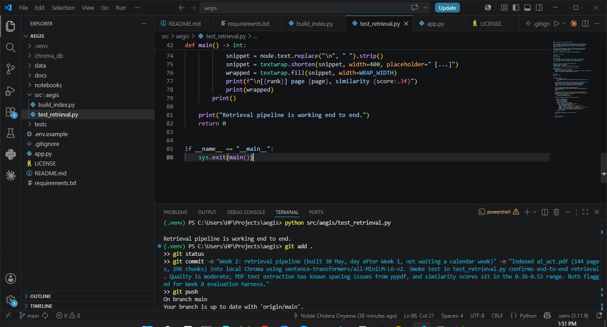

# Aegis build journey

This file is the human-readable history of the project. Each week gets a section with a date, what was built, what worked, what didn't, and a screenshot where one exists. The point is to leave a visible record so anyone reading the repo for the first time can scroll this file and follow the path from empty folder to live tool.

Code lives in the rest of the repo. This file is the story.

## Week 1 (29 May 2026)

Set up the project foundation. Python 3.11 virtual environment, project folder structure (`src/`, `data/`, `docs/`, `notebooks/`, `tests/`), a Streamlit Hello World page running at localhost:8501, `.gitignore`, `.env.example`, `LICENSE` (All Rights Reserved), and the README. Downloaded the six source PDFs into `data/`: the EU AI Act, Annex III (currently a duplicate of the Act, used for testing the slicing logic in a later week), the Irish General Scheme of the AI Regulation Bill 2026, and the three chapters of the GPAI Code of Practice (Transparency, Copyright, Safety and Security).

Local git repository initialised, public GitHub repo created at github.com/noble-chidera-onyema/aegis, first commit `3b7fb4c` pushed. Description and topic tags set for discoverability.

No screenshot for Week 1. The build was completed before this journey log existed.

## Week 2 (30 May 2026, the day after Week 1)

Built the retrieval pipeline. Indexed `ai_act.pdf` (144 pages) into 296 chunks of around 800 characters each with 100-char overlap, generated a 384-dimensional embedding for each chunk using `sentence-transformers/all-MiniLM-L6-v2`, and wrote the vectors to a local Chroma collection at `chroma_db/ai_act_v1`. Wrote a smoke test at `src/aegis/test_retrieval.py` that runs three sample queries against the index and prints the top three chunks per query with page number and similarity score.

Honest limitations at this stage. pypdf introduces letter-spacing artefacts on the CELEX-format PDF ("high-r isk", "Ar ticle"). Top-3 similarity scores currently sit in the 0.36 to 0.53 range, which is the loosely-related band rather than the strongly-relevant band. Query 3 ("Which AI practices are prohibited under the Act?") did not return Article 5 in the top three results, which is a real miss. All three issues are noted for the Week 8 evaluation harness, where the embedding model, PDF extraction library, and hybrid-search options get decided based on measured numbers rather than vibes.

The screenshot shows the project file tree on the left, the `test_retrieval.py` source code in the editor, the terminal output proving end-to-end retrieval works, and the git commit being made with the honest commit message naming the limitations.

Note on dates. Week 2 was built 30 May 2026, one day after Week 1, not after a full calendar week. The work was done in a single extended overnight session. Future weeks will not all be this compressed.

## Up next

Week 3, grounded question-and-answer. Connect a real LLM (Groq + Llama) to the existing retrieval pipeline so questions like "What does Article 13 require?" return an answer that quotes the actual retrieved chunks of the Act, with citations.